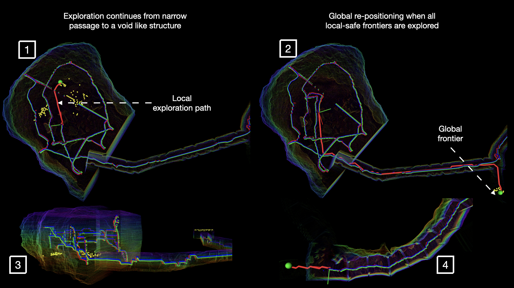

# Rapid Exploration Framework [REF]

The REF repository allows the user to test the exploration-planning framework in virtual subterranean cave environment. 

##

## Requirements

The REF repository only requires docker. If you do not have docker installed, please follow the docker installation instructions. If you already have docker, you can skip this step.

```bash
# Add Docker's official GPG key:
sudo apt-get update
sudo apt-get install ca-certificates curl gnupg
sudo install -m 0755 -d /etc/apt/keyrings
curl -fsSL https://download.docker.com/linux/ubuntu/gpg | sudo gpg --dearmor -o /etc/apt/keyrings/docker.gpg
sudo chmod a+r /etc/apt/keyrings/docker.gpg

# Add the repository to Apt sources:
echo \
  "deb [arch=$(dpkg --print-architecture) signed-by=/etc/apt/keyrings/docker.gpg] https://download.docker.com/linux/ubuntu \
  $(. /etc/os-release && echo "$VERSION_CODENAME") stable" | \
  sudo tee /etc/apt/sources.list.d/docker.list > /dev/null

sudo apt-get update

sudo apt-get install docker-ce docker-ce-cli containerd.io docker-buildx-plugin docker-compose-plugin

```
    
## Run Locally
The repository contains a Dockerfile that allows the user to build a docker image containing packages for exploration, planning, control and simulation environment. 

Clone the REF project

```bash
  git clone https://github.com/LTU-RAI/REF.git

```

Go to the REF directory

```bash
  cd ~/REF/docker
```

Build the docker image with following command. The build process might take some time when building for first time. 

```bash
  docker build -t REF .

```

Run the docker container with NVIDIA flags.

```bash
  docker run -it --net=host --gpus all --env="NVIDIA_DRIVER_CAPABILITIES=all" --env="DISPLAY" --env="QT_X11_NO_MITSHM=1" --volume="/tmp/.X11-unix:/tmp/.X11-unix:rw" REF:latest
``` 

If you do not have NVIDIA GPU :

```bash
  docker run -it --net=host  --env="DISPLAY" --env="QT_X11_NO_MITSHM=1" --volume="/tmp/.X11-unix:/tmp/.X11-unix:rw" REF:latest
```
Once you are inside the docker container, please run the following command to start the REF tmux session.
This session will launch the REF sub-modules and a Rviz window to visualize the drone exploring the cave environment. 

```bash
tmuxinator ref
```

## Acknowledgement

If you find the REF framework useful in your research, please consider citing the REF article.

```bibtex
@article{patel2023ref,
  title={REF: A Rapid Exploration Framework for Deploying Autonomous MAVs in Unknown Environments},
  author={Patel, Akash and Lindqvist, Bj{\"o}rn and Kanellakis, Christoforos and Agha-mohammadi, Ali-akbar and Nikolakopoulos, George},
  journal={Journal of Intelligent \& Robotic Systems},
  volume={108},
  number={3},
  pages={35},
  year={2023},
  publisher={Springer}
}

```

If you find the global planner useful in your research, please consider citing the DSP article. 


```bibtex
@article{karlsson2022d+,
  title={D+∗: A risk aware platform agnostic heterogeneous path planner},
  author={Karlsson, Samuel and Koval, Anton and Kanellakis, Christoforos and Nikolakopoulos, George},
  journal={Expert systems with applications},
  pages={119408},
  year={2022},
  publisher={Elsevier}
}
```
## Authors

- [@ Akash Patel](https://github.com/aakapatel) 


## Support

If you have any question please feel free to raise an issue or send an email to akash.patel@ltu.se. Thank you. 


